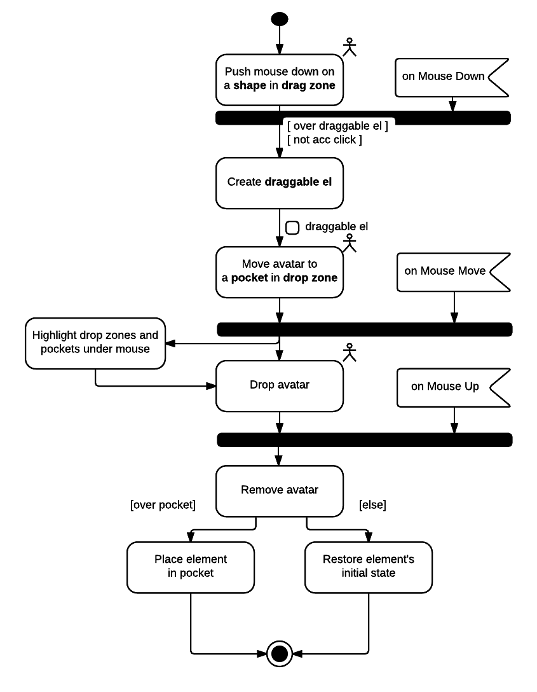
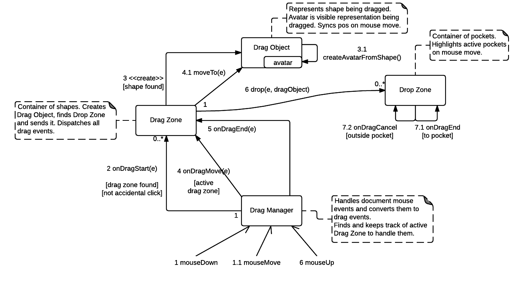

An OOP implementation of Drag & Drop in vanilla JavaScript. 
Inspired by http://learn.javascript.ru/drag-and-drop-plus.

To run, just open `index.html` (everything is static so far).

Available on plunk: http://plnkr.co/edit/2yNXLP?p=preview.

# UML Diagrams
Lucidchart: https://www.lucidchart.com/invitations/accept/a8140cac-9837-4b0a-95ef-ff9ac78ec5dc

## Activity diagram

## Collaboration diagram

